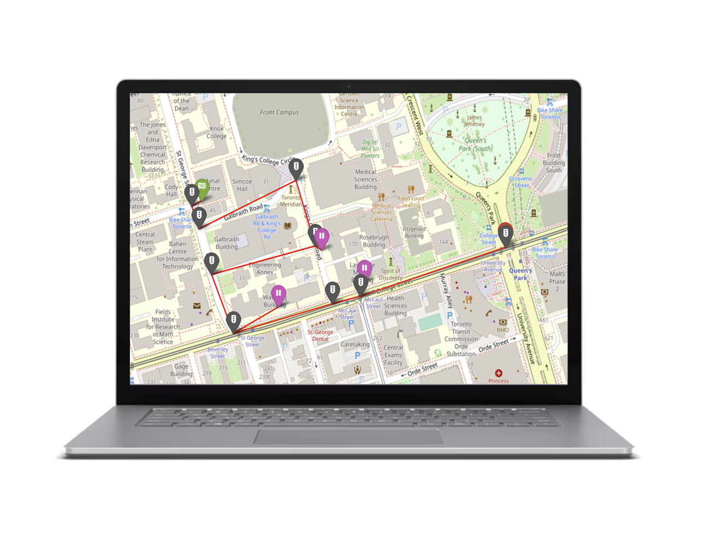

    <h1>Welcome to the <b>UofT Speedrunner!</b></h1>
    
A project by Eleonora Scognamiglio, Vibhas Raizada, Ben Sandoval, and Jason Barahan

    <!-- placeholder graphic, easily replaceable -->
    

<h3>Introduction</h3>
The <i>UofT Speedrunner</i> is a program for students of the University of Toronto to navigate their way around campus. This application finds the most optimal path between two buildings - and determines nearby amenities should people need them.

<h5>Compatible devices</h5>
The program currently functions for Windows and MacOS devices.
 
We plan to add support for UNIX-based devices and mobile devices very soon.

<h3>Features</h3>
<ul>
    <li>Navigate between two buildings on campus!</li>
    <li>Find buildings with certain amenities on campus!</li>
    <li>Determine multi-stop paths.</li>
</ul>

<h3>Use cases</h3>
<ul>
    <li>Determining an optimal path between Myhal Centre and Mining Building while stopping by buildings with an ATM and a coffee shop.</li>
    <li>Determining an optimal path between St. George Station and Wallberg Building while stopping by Sidney Smith Commons.</li>
    <li>Determining the best place to purchase coffee while campus WiFi is non-functional.</li>
</ul>

<h3>Known bugs</h3>
<ul>
    <li>Visualalizations depend on Folium, which works only on MacOS and Windows.</li>
</ul>

<h3><a href='https://github.com/JasonBarahan/speedrunner/wiki'>Documentation</a></h3>
Click the above link for information on how to use the application!

<h3>Downloads</h3>
WIP

<!--
A quick note on detailed documentation, such as how to use the application:

There are plans to switch the currently used CLI to a full GUI for improved UX. I will not write detailed documentation on how to use the application until the GUI switch is completed (to save time).
-->
